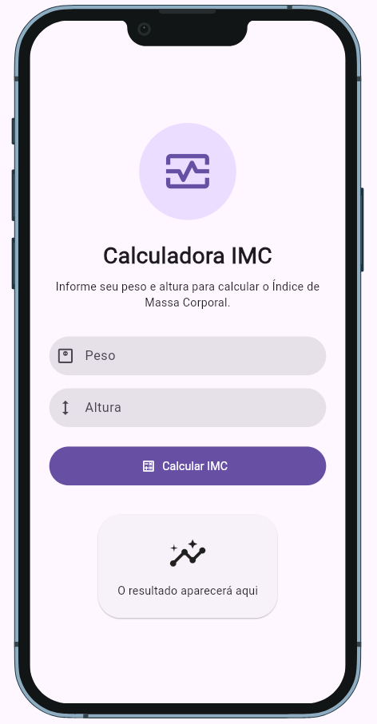

# 📊 Calculadora IMC

Aplicativo desenvolvido em Flutter para cálculo do **Índice de Massa Corporal (IMC)** de forma rápida, prática e intuitiva.

## ✨ Funcionalidades

- ✅ Informar peso em quilogramas (kg)
- ✅ Informar altura em metros (m)
- ✅ Cálculo automático do IMC
- ✅ Exibição da classificação do resultado
- ✅ Interface moderna baseada em Material Design 3
- ✅ Validação dos dados informados
- ✅ Compatível com Android, iOS, Web e Desktop

---

## 📱 Capturas de Tela

<p align="center">
  
</p>


---

## 🧮 Fórmula Utilizada

O cálculo do IMC é realizado através da fórmula:

```text
IMC = Peso / (Altura × Altura)
```

Exemplo:

```text
Peso: 75 kg
Altura: 1,75 m

IMC = 75 / (1,75 × 1,75)
IMC = 24,49
```

---

## 📈 Classificação do IMC

| IMC | Classificação |
|------|---------------|
| Menor que 18,5 | Abaixo do peso |
| 18,5 a 24,9 | Peso normal |
| 25,0 a 29,9 | Sobrepeso |
| 30,0 a 34,9 | Obesidade Grau I |
| 35,0 a 39,9 | Obesidade Grau II |
| 40,0 ou mais | Obesidade Grau III |

---

## 🚀 Tecnologias Utilizadas

- Flutter
- Dart
- Material Design 3

---

## 📂 Estrutura do Projeto

```text
lib/
├── main.dart
├── views/
│   └── calculadora_view.dart
├── controllers/
    └── calculadora_controller.dart
```

---

## ⚙️ Como Executar

### Clone o projeto

```bash
git clone https://github.com/rodrigoplotze/calculadora-imc.git
```

### Acesse a pasta

```bash
cd calculadora-imc
```

### Instale as dependências

```bash
flutter pub get
```

### Execute o aplicativo

```bash
flutter run
```

---

## 📋 Pré-requisitos

- Flutter SDK 3.x ou superior
- Dart SDK
- Android Studio, VS Code ou IntelliJ IDEA

Verifique a instalação:

```bash
flutter doctor
```

---

## 🎯 Objetivo do Projeto

Este projeto foi desenvolvido com fins de estudo e prática dos conceitos de:

- Gerenciamento de estado
- Widgets Flutter
- Material Design 3
- Entrada e validação de dados
- Desenvolvimento multiplataforma

---

## 🤝 Contribuições

Contribuições são bem-vindas.

Caso encontre algum problema ou tenha sugestões de melhoria, fique à vontade para abrir uma Issue ou enviar um Pull Request.

---

## 📄 Licença

Este projeto está licenciado sob a licença MIT.

---

## 👨‍💻 Autor

**Rodrigo de Oliveira Plotze**

GitHub: https://github.com/rodrigoplotze